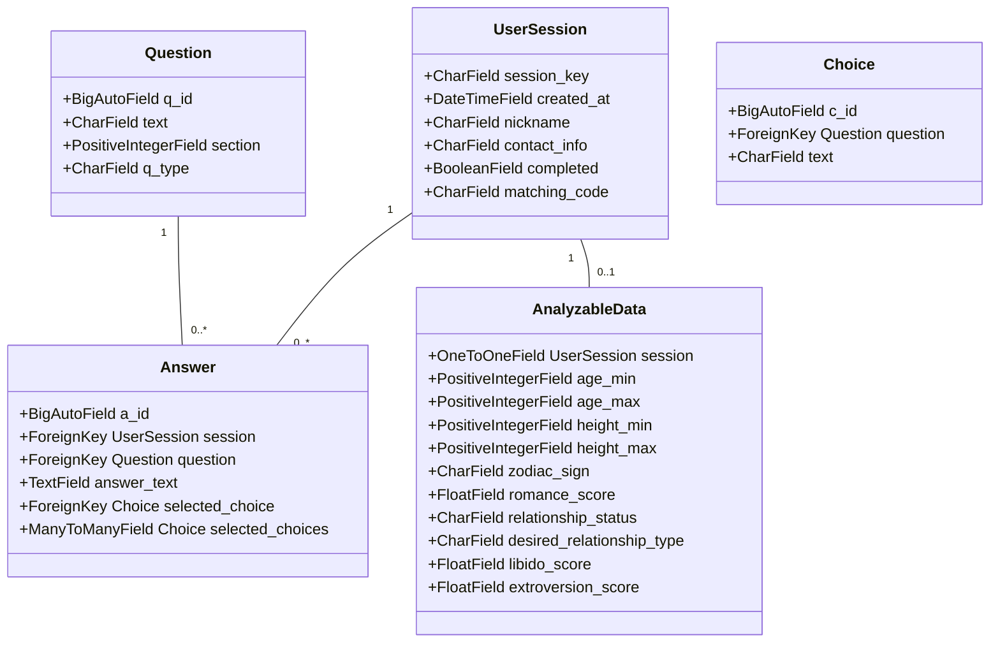

# Izdivac25 Project Documentation

## Project Overview

A Django-based matchmaking web application that connects people based on questionnaire responses. Designed for small-scale use with friends, focusing on anonymous participation without traditional user authentication.

## Key Features

- Anonymous session-based participation
- Multi-category questionnaire system
- Answer analysis for compatibility matching
- Admin interface for response management
- Google Forms-inspired UX

## Core Components

### Models Architecture



### Questionnaire Structure

- **5 Main Categories** with 3 answer types:
  1. Single Selection (Radio)
  2. Multiple Selection (Checkbox)
  3. Open Text (Textarea)

- Sections include:
  - Personal Information
  - Relationship Preferences
  - Relationship History
  - Additional Information
  - Matching Hints

## Technical Implementation

### Admin Interface

```python
# Key admin configurations:
class AnswerInline(admin.TabularInline):
    model = Answer
    extra = 0
    fields = ('question', 'text_answer', 'selected_choices') # Added fields to display
    readonly_fields = ('question', 'text_answer', 'selected_choices')

class UserSessionAdmin(admin.ModelAdmin):
    inlines = [AnswerInline]
    list_display = ('session_key', 'nickname', 'created_at')
    list_filter = ('created_at',) # Added list_filter
    search_fields = ('session_key', 'nickname')
```

### Form Handling

- Multi-page form implementation
- Session persistence through URL parameters
- JS validation (form.js)
- CSS styling for responsive design (styles.css)

### Template Structure

- answer_form.html (main questionnaire)
- success.html (submission confirmation)
- admin_view_responses.html (custom admin view)
- no_questions.html (displayed when there are no questions)

## URL Structure

```python
# Key URL patterns:
urlpatterns = [
    path('', views.start_questionnaire, name='start'),
    path('submit/', views.submit_answer, name='submit_answer'),
    path('submit/<int:question_id>/', views.submit_answer, name='submit_answer'),
    path('success/', views.success, name='success'),
    path('no-questions/', views.no_questions, name='no_questions'),
    path('view-responses/<str:admin_password>/', views.view_all_responses, name='view_responses'),
]
```

## Static Assets

- CSS:
  - Responsive grid layout
  - Progress indicators
  - Form styling
  
- JavaScript:
  - Form navigation
  - Answer validation
  - Session management
  - Progress bar functionality

## Business Logic

1. Matching Algorithm Foundation:

```python
# Example matching logic pseudocode
# This is just a placeholder, the actual logic is not yet implemented
def calculate_compatibility(session1, session2):
    score = 0
    
    # Analyze numerical ranges
    if sessions_share_analyzable_data(session1, session2):
        score += 30
        
    # Match question preferences
    score += compare_answers(
        session1.answers.filter(question__is_analyzable=True),
        session2.answers.filter(question__is_analyzable=True)
    )
    
    return min(score, 100)
```

## The matching algorithm is not fully implemented yet

## Development Environment

- Python 3.12
- Django 5.1.6
- SQLite database
- Virtualenv isolation

## Future Roadmap

1. Implement matching algorithm thresholds
2. Add CSV export capability
3. Create compatibility visualization
4. Enhance admin filtering
5. Add question weight system

****
